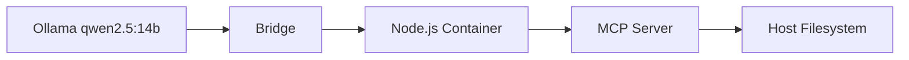

# Ollama MCP Bridge

A Python bridge that allows Ollama models to use MCP (Model Control Protocol) servers. This bridge enables Ollama models to access and use tools provided by MCP servers, effectively extending their capabilities.

## Current Configuration

The bridge is configured to use:
- Model: qwen2.5:14b
- MCP Server: @modelcontextprotocol/server-filesystem running in Node.js container
- Working Directory: /home/user/git (mounted as /workspace in container)

## How It Works

The bridge acts as a middleware between Ollama and MCP servers:

1. It launches a Node.js container and runs the MCP server using npx
2. Converts MCP tools to OpenAI function format that Ollama understands
3. Routes tool calls from Ollama to the MCP server
4. Returns tool results back to Ollama for continued conversation



## Requirements

- Python 3.8+
- Ollama running locally (default: http://localhost:11434)
- Docker
- Required Python packages:
  - requests
  - typing
  - dataclasses (included in Python 3.7+)

## Setup

1. Install required packages:
   ```bash
   pip install requests
   ```

2. Pull the Node.js Docker image:
   ```bash
   docker pull node:20
   ```

3. The configuration is set up in `config.json`:
   ```json
   {
       "model": "qwen2.5:14b",
       "mcpServer": {
           "command": "docker",
           "args": [
               "run",
               "--rm",
               "-i",
               "--network", "host",
               "-v", "/home/user/git:/workspace",
               "-w", "/workspace",
               "-e", "MCP_ALLOWED_PATHS=/workspace",
               "-e", "NODE_ENV=production",
               "-e", "PORT=3000",
               "node:20",
               "sh",
               "-c",
               "cd /workspace && npx -y @modelcontextprotocol/server-filesystem@latest"
           ],
           "allowed_directory": "/home/user/git",
           "env": {
               "NODE_ENV": "production",
               "MCP_ALLOWED_PATHS": "/home/user/git"
           }
       },
       "mcpServerName": "primary"
   }
   ```

4. Start Ollama and ensure it's running on http://localhost:11434

5. Run the bridge:
   ```bash
   python bridge.py config.json
   ```

## Docker Configuration Details

The MCP server runs in a Node.js Docker container with the following setup:

- Base Image: `node:20` (required for package compatibility)
- Volume Mount: Host's `/home/user/git` mounted as `/workspace` in container
- Working Directory: `/workspace`
- Environment Variables:
  - `MCP_ALLOWED_PATHS=/workspace`: Restricts file access to mounted volume
  - `NODE_ENV=production`: Sets production mode
  - `PORT=3000`: Sets server port
- Network: Host networking enabled
- Interactive Mode: `-i` flag enables stdin/stdout communication
- Auto Cleanup: `--rm` flag removes container after exit
- Command: Uses `sh -c` to run npx in the workspace directory

## Usage

Once running, the bridge provides an interactive prompt where you can ask the model to perform file operations:

```bash
$ python bridge.py config.json
Enter message (or 'quit' to exit): List the contents of the current directory
Response: I'll help you list the contents of the current directory...
[Tool execution details...]
Here are the contents of the directory...
```

The bridge will:
1. Send your message to the Ollama qwen2.5:14b model
2. If the model wants to use a filesystem operation, route the request to the MCP server in the container
3. Return the operation results to the model
4. Return the model's final response to you

## Available File Operations

The filesystem MCP server provides tools for:
- Reading files
- Listing directory contents
- Checking file existence
- Getting file information

All operations are restricted to the mounted volume (/workspace in container).

## Error Handling

The bridge includes robust error handling:
- Container startup issues
- Connection failures to Ollama or MCP server
- File operation errors
- Permission issues
- Invalid configurations
- Timeouts and disconnections

All errors are logged and handled gracefully, with appropriate error messages returned to the user.

## Security

- File operations are restricted to the mounted volume
- Container runs with minimal privileges
- No write operations are enabled by default
- All operations are logged for auditing
- Container is automatically removed after exit

## License

MIT License - See LICENSE file for details